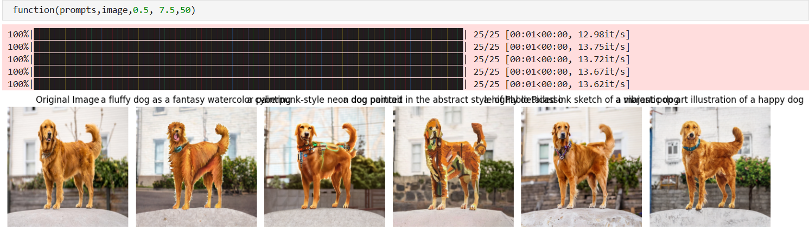

# Stable Diffusion Parameter Testing

This project explores how changing three different parameters in the Stable Diffusion model affects the generated output. We conducted controlled experiments using a Jupyter notebook and visualized the results using three sample images: `test1.png`, `test2.png`, and `test3.png`.

## Table of Contents
- [Overview](#overview)
- [Parameters Tested](#parameters-tested)
- [Results](#results)
- [How to Run](#how-to-run)
- [Dependencies](#dependencies)
- [License](#license)

## Overview

Stable Diffusion is a text-to-image model that generates realistic images based on input prompts. In this experiment, we tested the influence of three key parameters:

1. **Guidance Scale**
2. **Number of Inference Steps**
3. **Random Seed / Noise Level**

Each test was conducted using the same prompt while varying one parameter at a time.

## Parameters Tested

### 1. **Guidance Scale**
- Controls how closely the image sticks to the prompt.
- Low scale = more freedom/creativity.
- High scale = more prompt accuracy.

### 2. **Number of Inference Steps**
- More steps typically yield higher-quality images.
- Fewer steps are faster but may result in lower quality.

### 3. **Random Seed / Noise**
- Affects image variety for the same prompt.
- Useful for generating different versions of the same idea.

## Results

Here are the output images generated for each test:

### 🔹 Test 1: Varying **Guidance Scale**

### 🔹 Test 2: Varying **Number of Inference Steps**

### 🔹 Test 3: Varying **Random Seed / Noise**

